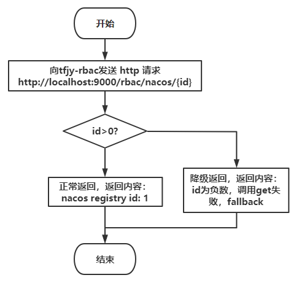
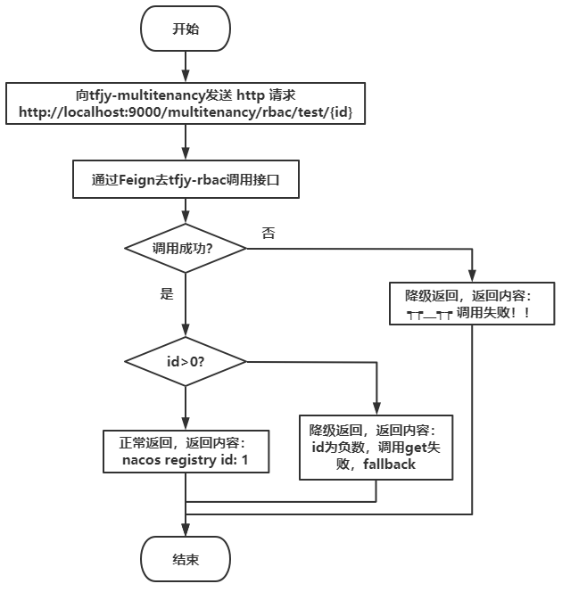
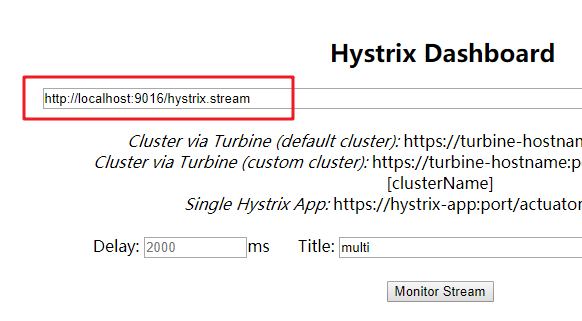

@[toc]

# 1 架构说明

采用 Spring Cloud + Spring Cloud Alibaba

具体组件使用: Nacos, Ribbon, Gateway, OpenFeign, Hystrix

#  2 模块说明

tfjy-auth3         
  |- tfjy-commons         
  |- tfjy-gateway         
  |- tfjy-job         
  |- tfjy-login         
  |- tfjy-message         
  |- tfjy-multitenancy         
  |- tfjy-rbac         

# 3 服务说明  

| 服务名称 | 功能 | 端口 |
|---|---|---|
| tfjy-commons | 包含工具类、公共实体等内容 | 无端口，不作为服务 |
| tfjy-gateway | gateway网关，所有的http请求都从此处进入并进行转发 | 9000 |
| tfjy-job | 集成xxl-job，执行定时任务 | 9026，预留9026-9030 |
| tfjy-login | 登录模块，包括项目登录、第三方登录  | 9006，预留9006-9010 |
| tfjy-message | 消息推送，包含钉钉消息、邮件、短信、vx公众号  | 9021，预留9021-9025 |
| tfjy-multitenancy | 多租户支持模块，包括多租户申请部分的内容  | 9016，预留9016-9020 |
| tfjy-rbac | 基础权限控制，人员、组织、资源、项目的内容   | 9001，预留9001-9005 |

# 4 各个组件说明

## 4.1 nacos

nacos作为服务注册中心，不与服务进行耦合，同时代替了 eureka 与 config

配置注册进入 nacos

application.yml
```yaml
spring:
  application:
    name: tfjy-auth3-rbac-service
  cloud:
    nacos:
      discovery:
        server-addr: 114.55.27.152:8848 # nacos 地址
```

## 4.2 ribbon

nacos内部自带了ribbon的包，所以不需要重新引入ribbon

ribbon的负载均衡是在消费端进行的，所以，只需要在消费端进行ribbon的配置即可

配置了这部分之后，就可以使用nacos中的配置权重进行负载均衡了
```java
package com.tfjybj.multitenancy.ribbon;

import com.alibaba.cloud.nacos.NacosDiscoveryProperties;
import com.alibaba.cloud.nacos.ribbon.NacosServer;
import com.alibaba.nacos.api.exception.NacosException;
import com.alibaba.nacos.api.naming.pojo.Instance;
import com.netflix.client.config.IClientConfig;
import com.netflix.loadbalancer.AbstractLoadBalancerRule;
import com.netflix.loadbalancer.DynamicServerListLoadBalancer;
import com.netflix.loadbalancer.Server;
import lombok.extern.slf4j.Slf4j;
import org.springframework.beans.factory.annotation.Autowired;

@Slf4j
public class NacosWeightRandomRule extends AbstractLoadBalancerRule {

    @Autowired
    private NacosDiscoveryProperties discoveryProperties;

    @Override
    public Server choose(Object key) {
        DynamicServerListLoadBalancer loadBalancer = (DynamicServerListLoadBalancer) getLoadBalancer();
        String name = loadBalancer.getName();
        try {
            Instance instance = discoveryProperties.namingServiceInstance()
                    .selectOneHealthyInstance(name);

            log.info("选中的instance = {}", instance);
            /*
             * instance转server的逻辑参考自：
             * org.springframework.cloud.alibaba.nacos.ribbon.NacosServerList.instancesToServerList
             */
            return new NacosServer(instance);
        } catch (NacosException e) {
            log.error("发生异常", e);
            return null;
        }
    }

    @Override
    public void initWithNiwsConfig(IClientConfig iClientConfig) {
    }
}
```

## 4.3 gateway

gateway使用单独的服务来进行，而且gateway一定要做集群，并且需要负载均衡，所有的Http请求都从此处进入，并进行转发

正因为所有的Http请求都从此进入，所以，在gateway处一定要加上负载均衡

过滤器配置 ---- 移步gateway模块的filter

请求转发配置
```yaml
server:
  port: 9000
spring:
  application:
    name: tfjy-auth3-gateway
  cloud:
    nacos:
      discovery:
        server-addr: 114.55.27.152:8848
    gateway:
      discovery:
        locator:
          enabled: true
      routes:
        - id: multi_routh # 唯一id
          uri: lb://tfjy-auth3-multitenancy-service # 负载均衡，lb代表在注册中心获取服务，后边是服务名称
          predicates: # 断言
            - Path=/multitenancy/** # 请求转发的地址
        # 这段的意思就是，所有以multitenancy开头的请求，都会被转发到上面uri中写的服务

        - id: rbac_routh
          uri: lb://tfjy-auth3-rbac-service
          predicates:
            - Path=/rbac/**
```

举个栗子：

id 为 multi_routh 的 route

比如请求 http://localhost:9000/multitenancy/get/1

这个时候请求就会自动被转发到名为 tfjy-auth3-multitenancy-service 的服务下

这个时候也就相当于 http://tfjy-auth3-multitenancy-service/multitenancy/get/1

但是实际上还会根据服务的名称找到服务的list，然后进行负载均衡

## 4.4 OpenFeign

OpenFeign 是在 Spring Cloud 在 Feign 的基础上支持了 SpringMVC 的注解，
如 @RequestMapping 等等。

OpenFeign 的 @FeignClient 可以解析 SpringMVC 的 @RequestMapping 注解下的接口，
并通过动态代理的方式产生实现类，实现类中做负载均衡

在服务间调用的 service 上添加注解 @FeignClient

value 表示服务名称，这样就可以直接进行服务间调用了

后边的fallback是后边的降级

```java
@Component
@FeignClient(value = "tfjy-auth3-rbac-service", fallback = TestRbacFallbackService.class)
public interface TestRbacService {

    @GetMapping("/rbac/nacos/{id}")
    String get(@PathVariable("id") Long id);

}
```

## 4.5 Hystrix

在微服务场景中，通常会有很多层的服务调用。
如果一个底层服务出现问题，故障会被向上传播给用户。
我们需要一种机制，当底层服务不可用时，可以阻断故障的传播。
这就是断路器的作用。他是系统服务稳定性的最后一重保障。

Hystrix 的功能：降级、熔断

### 4.5.1 降级

服务降级是从整个系统的负荷情况出发和考虑的，对某些负荷会比较高的情况，为了预防某些功能（业务场景）出现
负荷过载或者响应慢的情况，在其内部暂时舍弃对一些非核心的接口和数据的请求，而直接返回一个提前准备好的fallback
（退路）错误处理信息。这样，虽然提供的是一个有损的服务，但却保证了整个系统的稳定性和可用性。

```
    @HystrixCommand(commandProperties = {
            @HystrixProperty(name = "execution.isolation.thread.timeoutInMilliseconds", value = "2000")
    })
    public String get(Long id) {
        if (id < 0) {
            throw new RuntimeException("id<0");
        }
        return "nacos registry id: " + id;
    }

    public String getFallback(Long id) {
        return "id为负数，调用get失败，fallback";
    }
```

### 4.5.2 默认降级

在要进行 fallback 的 controller 上，添加默认 fallback 的注解

再添加好默认的 fallback 方法

```java
@DefaultProperties(defaultFallback = "defaultFallbackHandler")
public class TestRbacController {

    public String defaultFallbackHandler() {
        return "默认调用失败！";
    }

}
```

### 4.5.3 通过feign调用进行降级

因为配置了默认 fallback，如果使用了 Feign，这个时候要对 Feign 调用的接口进行 fallback

新建 service 对应的 fallback 类，实现 service 接口，在这里写清楚每个接口的熔断方法

```java
@Component
public class TestRbacFallbackService implements TestRbacService {

    @Override
    public String get(Long id) {
        return "┭┮﹏┭┮ 调用失败！！";
    }

}
```

配置 Feign 调用的 service

添加上 fallback 对应的class即可

```java
@Component
@FeignClient(value = "tfjy-auth3-rbac-service", fallback = TestRbacFallbackService.class)
public interface TestRbacService {

    @GetMapping("/rbac/nacos/{id}")
    String get(@PathVariable("id") Long id);
    
}
```


Q: 为什么配置了默认 fallback 还要配置自定义 fallback
A: 默认 fallback 是只要出错了，就会进入自定义 fallback


### 4.5.4 熔断

服务熔断的作用类似于我们家用的保险丝，当某服务出现不可用或响应超时的情况时，为了防止整个系统出现雪崩，
暂时停止对该服务的调用。

以 tfjy-rbac 为例

```java
@Service
public class TestService {

    @HystrixCommand(fallbackMethod = "getFallback", commandProperties = {
            @HystrixProperty(name = "circuitBreaker.enabled", value = "true"), // 是否开启熔断器
            @HystrixProperty(name = "circuitBreaker.requestVolumeThreshold", value = "10"), // 请求次数
            @HystrixProperty(name = "circuitBreaker.sleepWindowInMilliseconds", value = "10000"), // 时间窗口期
            @HystrixProperty(name = "circuitBreaker.errorThresholdPercentage", value = "60") // 失败率达到多少后跳闸
    })
    public String get(Long id) {
        if (id < 0) {
            throw new RuntimeException("id<0");
        }
        return "nacos registry id: " + id;
    }

    public String getFallback(Long id) {
        return "id为负数，调用get失败，fallback";
    }
}
```

@HystrixCommand 注解用来配置 fallback

fallbackMethod 用来配置 fallback 方法
commandProperties 用来配置了和降级等一系列的属性

    @HystrixProperty(name = "circuitBreaker.enabled", value = "true"), // 是否开启熔断器
    @HystrixProperty(name = "circuitBreaker.requestVolumeThreshold", value = "10"), // 请求次数
    @HystrixProperty(name = "circuitBreaker.sleepWindowInMilliseconds", value = "10000"), // 时间窗口期
    @HystrixProperty(name = "circuitBreaker.errorThresholdPercentage", value = "60") // 失败率达到多少后跳闸

这四个注解的意思就是 在 10000 ms内，请求10次，失败率达到60%也就是6次，就会触发熔断

id大于0 和 id小于0 分别进行测试，就可以看到熔断的结果


### 4.5.5 降级 demo

利用上面的熔断做测试，熔断其实就是降级次数太多，直接就熔断了

主要代码贴一下

tfjy-rbac:

```java
@Service
public class TestService {

    @HystrixCommand(fallbackMethod = "getFallback", commandProperties = {
            @HystrixProperty(name = "circuitBreaker.enabled", value = "true"), // 是否开启熔断器
            @HystrixProperty(name = "circuitBreaker.requestVolumeThreshold", value = "10"), // 请求次数
            @HystrixProperty(name = "circuitBreaker.sleepWindowInMilliseconds", value = "10000"), // 时间窗口期
            @HystrixProperty(name = "circuitBreaker.errorThresholdPercentage", value = "60") // 失败率达到多少后跳闸
    })
    public String get(Long id) {
        if (id < 0) {
            throw new RuntimeException("id<0");
        }
        return "nacos registry id: " + id;
    }

    public String getFallback(Long id) {
        return "id为负数，调用get失败，fallback";
    }
}
```

tfjy-multitenancy:

```java
@Component
@FeignClient(value = "tfjy-auth3-rbac-service", fallback = TestRbacFallbackService.class)
public interface TestRbacService {

    @GetMapping("/rbac/nacos/{id}")
    String get(@PathVariable("id") Long id);

}

@Component
public class TestRbacFallbackService implements TestRbacService {

    @Override
    public String get(Long id) {
        return "┭┮﹏┭┮ 调用失败！！";
    }

}
```

提前说明

tfjy-rbac 中的接口 http://localhost:9000/multitenancy/rbac/test/{id} 配置了降级

tfjy-multitenancy 通过 Feign 调用上边这个接口

| 调用接口 | 返回结果 |
|---|---|
| http://localhost:9000/rbac/nacos/-1 | id为负数，调用get失败，fallback |
| http://localhost:9000/rbac/nacos/1 | nacos registry id: 1 |
| http://localhost:9000/multitenancy/rbac/test/1 | nacos registry id: 1 |
| http://localhost:9000/multitenancy/rbac/test/-1 | id为负数，调用get失败，fallback |
| 在这停了 tfjy-rbac |  | 
| http://localhost:9000/multitenancy/rbac/test/1 | ┭┮﹏┭┮ 调用失败！！ |



### Hystrix Dashboard

除了隔离依赖服务的调用以外，Hystrix还提供了近实时的监控，Hystrix会实时、累加地记录所有关于HystrixCommand的执行信息，包括每秒执行多少请求多少成功，多少失败等。

引入依赖

```xml
<!--hystrix dashboard-->
<dependency>
    <groupId>org.springframework.cloud</groupId>
    <artifactId>spring-cloud-starter-netflix-hystrix-dashboard</artifactId>
</dependency>
```

```java
@EnableHystrixDashboard
public class RbacMainApplication {

    public static void main(String[] args) {
        SpringApplication.run(RbacMainApplication.class, args);
    }

    /**
     * 此配置是为了服务监控而配置，与服务容错本身无观，springCloud 升级之后的坑
     * ServletRegistrationBean因为springboot的默认路径不是/hystrix.stream
     * 只要在自己的项目中配置上下面的servlet即可
     */
    @Bean
    public ServletRegistrationBean getServlet() {
        HystrixMetricsStreamServlet streamServlet = new HystrixMetricsStreamServlet();
        ServletRegistrationBean<HystrixMetricsStreamServlet> registrationBean = new ServletRegistrationBean<>(streamServlet);
        registrationBean.setLoadOnStartup(1);
        registrationBean.addUrlMappings("/hystrix.stream");
        registrationBean.setName("HystrixMetricsStreamServlet");
        return registrationBean;
    }
}
```

此处有两点

1. 添加@EnableHystrixDashboard注解
2. 在启动类中指定监控路径

然后访问一下就可以了，要注意一下地址：http://localhost:9016/hystrix.stream




## 4.6 zipkin

zipkin负责了项目中的链路追踪，每个服务向zipkin报告计时数据，zipkin会根据调用关系通过Zipkin UI生成依赖关系图。

引入依赖


```xml
<!--包含了sleuth+zipkin-->
<dependency>
    <groupId>org.springframework.cloud</groupId>
    <artifactId>spring-cloud-starter-zipkin</artifactId>
</dependency>
```

```yaml
spring:
  zipkin:
    base-url: http://114.55.27.152:9411 # zipkin地址
  sleuth:
    sampler:
      probability: 1 # 
```

Sleuth 默认采样算法的实现是 Reservoir sampling，具体的实现类是 PercentageBasedSampler,默认的采样比例为: 0.1，即 10%。

我们可以通过 spring.sleuth.sampler.probability 来设置，所设置的值介于 0 到 1 之间，1 则表示全部采集

# Swagger 页面配置

这里是 swagger 页面得配置

引入依赖：
```xml
<!--引入Swagger2依赖 -->
<dependency>
    <groupId>io.springfox</groupId>
    <artifactId>springfox-swagger2</artifactId>
</dependency>
<dependency>
    <groupId>io.springfox</groupId>
    <artifactId>springfox-swagger-ui</artifactId>
</dependency>
```

添加 swagger 配置类

```java
package com.tfjybj.rbac.config;

import org.springframework.context.annotation.Bean;
import org.springframework.context.annotation.Configuration;
import springfox.documentation.builders.ApiInfoBuilder;
import springfox.documentation.builders.PathSelectors;
import springfox.documentation.builders.RequestHandlerSelectors;
import springfox.documentation.service.ApiInfo;
import springfox.documentation.spi.DocumentationType;
import springfox.documentation.spring.web.plugins.Docket;
import springfox.documentation.swagger2.annotations.EnableSwagger2;

/**
 * User: Banana
 * Date: 2020/5/25
 * Time: 14:30
 * DingDing: 17731618462
 * Description:
 **/


@EnableSwagger2
@Configuration
public class SwaggerConfig {

    @Bean
    public Docket createRestApi() {
        return new Docket(DocumentationType.SWAGGER_2)
                .apiInfo(apiInfo())
                .select()
                .apis(RequestHandlerSelectors.basePackage("com.tfjybj.rbac.controller"))
                .paths(PathSelectors.any())
                .build();
    }

    private ApiInfo apiInfo() {
        return new ApiInfoBuilder()
                .title("天赋吉运-权限系统-rbac服务-RESTful APIs")
                .description("rbac管理")
                .license("证书")
                .licenseUrl("证书地址")
                .version("1.0")
                .build();
    }

}
```

